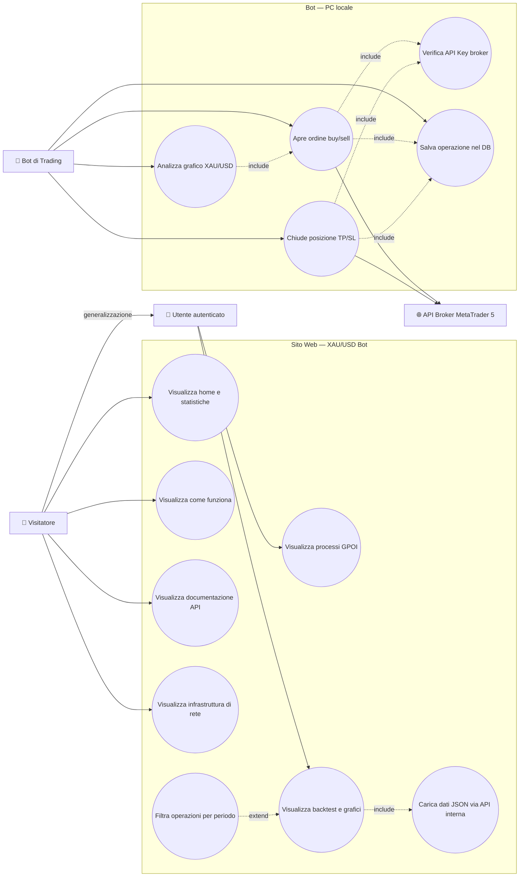
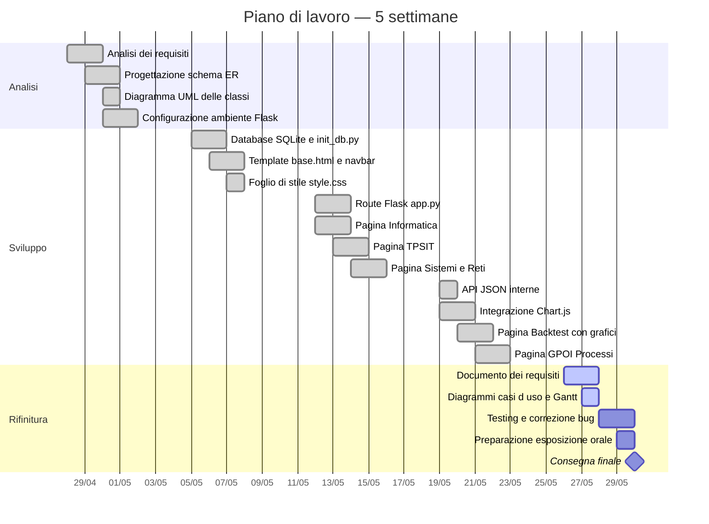

# Documento dei Requisiti — XAU/USD Algorithmic Trading Bot

**Progetto di fine anno · Modulo 03 — Sviluppo Web e Database**

| Campo | Valore |
|-------|--------|
| Studente | Romeo D'Angelosante |
| Classe | 5ªM · A.S. 2025/2026 |
| Materie | TPSIT · GPOI · Informatica · Sistemi e Reti |
| Data | 26 aprile 2026 |

---

## 1. Introduzione

### 1.1 Scopo del documento

Lo scopo di questo documento è:

- descrivere in modo chiaro il prodotto realizzato e le sue funzionalità principali;
- raccogliere i requisiti funzionali e non funzionali;
- fornire una prima progettazione concettuale e una roadmap di lavoro con diagrammi ER, UML e casi d'uso, organizzata nelle fasi di analisi, sviluppo e rifinitura;
- definire una roadmap di lavoro con milestone e attività principali.

### 1.2 Contesto

Il progetto rientra nel percorso del quinto anno dell'indirizzo Informatica e Telecomunicazioni. Gli studenti devono realizzare un piccolo progetto web con backend in Python/Flask e database relazionale. Il tema scelto è il trading algoritmico, un ambito reale in cui l'informatica svolge un ruolo centrale: sistemi automatizzati analizzano dati finanziari e prendono decisioni operative senza intervento umano.

Il progetto soddisfa i requisiti consigliati dalla traccia del modulo:

- gestione dati persistente tramite database relazionale SQLite;
- interfaccia web con visualizzazione dinamica (grafici Chart.js, tabelle aggiornate dal DB);
- backend in Python/Flask con routing, template Jinja2 ed endpoint JSON;
- relazioni tra più tabelle nel database (operazioni, segnali, statistiche, configurazione).

### 1.3 Tema del progetto

**Tema scelto: XAU/USD Algorithmic Trading Bot.**

Il progetto consiste in un sito web che documenta e visualizza il funzionamento di un bot di trading automatico sul mercato dell'oro (coppia XAU/USD), installato localmente su PC e basato su MetaTrader 5. Il sito:

- spiega la logica algoritmica del bot (analisi della struttura storica del grafico e pattern recognition);
- documenta l'architettura API REST usata per comunicare con il broker;
- mostra i risultati reali di un backtest su 779 operazioni simulate (deposito $1.000, profitto netto $5.606);
- espone le statistiche di performance tramite grafici interattivi generati con Chart.js;
- legge e scrive i dati da un database SQLite con quattro tabelle correlate.

---

## 2. Obiettivi generali

- Realizzare un sito web funzionante con Flask che mostri dati reali letti da un database SQLite.
- Documentare in modo tecnico ogni componente del sistema, collegandolo alla materia di riferimento.
- Implementare un database relazionale con quattro tabelle e le relative relazioni.
- Visualizzare i risultati del backtest attraverso grafici interattivi (profitto cumulativo, win rate mensile, distribuzione operazioni).
- Spiegare l'architettura API REST usata dal bot per comunicare con il broker MetaTrader 5.
- Illustrare l'infrastruttura di rete del sistema (TCP/IP, HTTPS/TLS 1.3, autenticazione con API key).
- Presentare il processo operativo completo del bot tramite diagramma di flusso in stile BPMN.
- Analizzare le performance mensili e le metriche di rischio (drawdown, Sharpe ratio, fattore di recupero).

---

## 3. Stakeholder e attori

### 3.1 Stakeholder

| Stakeholder | Ruolo | Interesse |
|-------------|-------|-----------|
| Studente | Sviluppatore | Realizzare il progetto rispettando i requisiti tecnici e didattici |
| Docente | Valutatore | Verificare correttezza tecnica, completezza e collegamento alle materie |
| Utente finale | Visitatore del sito | Comprendere il funzionamento del bot e visualizzare i risultati del backtest |

### 3.2 Attori principali

- **Visitatore** — accede al sito, naviga le pagine e visualizza grafici e tabelle senza autenticazione.
- **Utente (autenticato)** — attore specializzato del Visitatore; in un'estensione futura potrebbe salvare configurazioni personalizzate.
- **Bot di trading** — attore esterno che legge e scrive dati nel database durante l'esecuzione.
- **API del broker (MetaTrader 5)** — sistema esterno con cui il bot comunica tramite HTTP/REST.
- **Amministratore (opzionale)** — potrebbe accedere a una futura area di configurazione protetta.

---

## 4. Requisiti funzionali

### 4.1 Requisiti principali

| ID | Requisito | Materia |
|----|-----------|---------|
| RF01 | Visualizzazione della home page con statistiche chiave del backtest lette dal database | TPSIT / Informatica |
| RF02 | Pagina "Come funziona": algoritmo del bot, struttura dati OHLC, tabella pattern riconosciuti | Informatica |
| RF03 | Pagina "API": endpoint REST, esempi richieste HTTP GET/POST, risposte JSON, codici di risposta | TPSIT |
| RF04 | Pagina "Infrastruttura": architettura di rete, protocolli TCP/IP e TLS 1.3, gestione API key, tabella configurazione dal DB | Sistemi e Reti |
| RF05 | Pagina "Processi": flusso operativo BPMN, statistiche mensili, metriche di rischio | GPOI |
| RF06 | Pagina "Backtest": grafici interattivi Chart.js e tabella delle operazioni simulate | GPOI / Informatica |
| RF07 | API JSON interna `/api/profitto-cumulativo` per alimentare il grafico del profitto | TPSIT |
| RF08 | API JSON interna `/api/stats-mensili` per alimentare il grafico a barre mensile | TPSIT |
| RF09 | Database SQLite con quattro tabelle: operazione, segnale, statistica, configurazione | Informatica |
| RF10 | Navbar con indicazione della pagina attiva e footer con materia di riferimento | Informatica |

### 4.2 User stories

- Come visitatore, voglio vedere le statistiche principali del backtest nella home, così da capire subito le performance del bot.
- Come visitatore, voglio leggere la documentazione degli endpoint API con esempi di codice Python, così da capire come il bot comunica con il broker.
- Come visitatore, voglio vedere i grafici del profitto cumulativo e mensile, così da comprendere l'andamento nel tempo.
- Come visitatore, voglio consultare il diagramma BPMN del processo operativo, così da capire come il bot prende le decisioni.
- Come studente che presenta il progetto, voglio che ogni pagina riporti la materia di riferimento, così da guidare la commissione durante l'esposizione.

---

## 5. Requisiti non funzionali

| ID | Categoria | Descrizione |
|----|-----------|-------------|
| RNF01 | Usabilità | Interfaccia chiara e navigabile; la navbar indica sempre la pagina corrente |
| RNF02 | Prestazioni | Pagine caricate in meno di 2 secondi in locale; grafici Chart.js senza lag |
| RNF03 | Sicurezza | L'API key del broker non deve mai comparire nel codice sorgente; salvata in file `.env` escluso dal repository |
| RNF04 | Portabilità | Progetto eseguibile localmente con `python app.py` dopo aver installato Flask |
| RNF05 | Manutenibilità | Codice organizzato con separazione netta tra route (`app.py`), template HTML e file statici |
| RNF06 | Persistenza | I dati del database persistono tra una sessione e l'altra senza essere ricreati ad ogni avvio |
| RNF07 | Responsività | Il sito deve essere leggibile su schermi da almeno 1280px |
| RNF08 | Coerenza visiva | Ogni pagina usa il template `base.html` con navbar, footer e foglio di stile condivisi |

---

## 6. Casi d'uso

### 6.1 Casi d'uso essenziali

- Visualizza home e statistiche
- Visualizza come funziona il bot
- Visualizza documentazione API
- Visualizza infrastruttura di rete
- Visualizza processi GPOI
- Visualizza backtest e grafici
- Analizza grafico XAU/USD *(bot)*
- Apre ordine buy/sell *(bot)*
- Salva operazione nel database *(bot)*
- Chiude posizione TP/SL *(bot)*

### 6.2 Descrizione semplificata dei casi d'uso

| ID | Nome | Descrizione |
|----|------|-------------|
| UC1 | Visualizza home | Il visitatore apre il sito; Flask legge le statistiche dal DB e renderizza la pagina con operazioni totali, profitto, win rate e Sharpe |
| UC2 | Come funziona | Il visitatore consulta la logica algoritmica del bot, la struttura dati OHLC, i pattern riconosciuti e le statistiche di money management |
| UC3 | Documentazione API | Il visitatore legge gli endpoint REST usati dal bot, gli esempi HTTP GET/POST, le risposte JSON e i codici di risposta HTTP |
| UC4 | Infrastruttura | Il visitatore consulta l'architettura di rete (TCP/IP, HTTPS, TLS 1.3) e la tabella di configurazione letta dal DB |
| UC5 | Processi GPOI | Il visitatore vede il flusso BPMN del bot, le statistiche mensili e le metriche di rischio |
| UC6 | Backtest e grafici | Il visitatore consulta i 4 grafici Chart.js e la tabella delle prime 50 operazioni simulate |
| UC7 | Carica dati JSON | Il browser esegue fetch verso le API interne Flask per alimentare i grafici — **incluso** in UC6 |
| UC8 | Filtra operazioni | Il visitatore filtra le operazioni per periodo o esito durante la visualizzazione del backtest — **estende** UC6 |
| UC9 | Analizza grafico | Il bot scarica le candele OHLC via API e analizza la struttura storica per riconoscere pattern |
| UC10 | Apre ordine | Rilevato un segnale, il bot invia HTTP POST al broker con simbolo, volume, SL e TP — **include** verifica API Key e salvataggio nel DB |
| UC11 | Verifica API Key | Il sistema verifica l'autenticazione al broker — **incluso** in UC10 e UC13 |
| UC12 | Salva nel DB | Il bot inserisce il record nelle tabelle operazione e segnale — **incluso** in UC10 |
| UC13 | Chiude posizione | Quando il prezzo raggiunge TP o SL, il bot invia la chiusura al broker — **include** verifica API Key |

### 6.3 Relazioni tra casi d'uso: include ed extend

In un diagramma dei casi d'uso si usano due tipi di relazioni aggiuntive:

- **`<<include>>`**: rappresenta un comportamento obbligatorio riutilizzabile. Un caso d'uso base include un altro quando il suo comportamento è *sempre* eseguito.
- **`<<extend>>`**: rappresenta un comportamento opzionale o condizionale che si aggiunge al caso d'uso base solo in certe condizioni.

I casi d'uso non devono essere confusi con i rapporti tra attori. Nel progetto, **Utente** è un attore specializzato di **Visitatore**: può fare tutto ciò che fa il Visitatore, più alcune azioni aggiuntive. Questo si modella con una **generalizzazione tra attori**, non con include o extend.

Le relazioni `<<include>>` del progetto:

- **UC6 `<<include>>` UC7**: visualizzare il backtest richiede *sempre* il caricamento dei dati JSON via API interna Flask.
- **UC10 `<<include>>` UC11**: aprire un ordine richiede *sempre* la verifica dell'API Key del broker.
- **UC10 `<<include>>` UC12**: aprire un ordine salva *sempre* l'operazione nel database.
- **UC13 `<<include>>` UC11**: chiudere una posizione richiede *sempre* la verifica dell'API Key.

Le relazioni `<<extend>>` del progetto:

- **UC8 `<<extend>>` UC6**: filtrare le operazioni per periodo o esito è un'azione *opzionale* che si attiva solo se il visitatore lo richiede durante la visualizzazione del backtest.

### 6.4 Diagramma dei casi d'uso



---

## 7. Glossario dei termini

| Termine | Definizione |
|---------|-------------|
| XAU/USD | Coppia valutaria che rappresenta il prezzo dell'oro (XAU) in dollari americani (USD) |
| Bot di trading | Software automatizzato che analizza i mercati e apre/chiude posizioni senza intervento umano |
| Backtest | Simulazione di una strategia su dati storici reali per valutarne le performance prima di usarla live |
| Candela OHLC | Unità di dati di mercato: Open (apertura), High (massimo), Low (minimo), Close (chiusura) |
| API REST | Interfaccia che permette la comunicazione tra sistemi via HTTP seguendo i principi REST |
| API Key | Chiave di autenticazione univoca fornita dal broker che autorizza il bot a inviare ordini |
| Win rate | Percentuale di operazioni chiuse in profitto rispetto al totale |
| Drawdown | Riduzione percentuale del capitale rispetto al picco massimo raggiunto |
| Indice di Sharpe | Indicatore che misura il rendimento rispetto al rischio. Valori sopra 3 sono eccellenti |
| Fattore di profitto | Rapporto tra guadagni lordi totali e perdite lorde totali. Valore > 1 = strategia profittevole |
| Stop Loss (SL) | Livello di prezzo a cui il bot chiude automaticamente una posizione in perdita |
| Take Profit (TP) | Livello di prezzo a cui il bot chiude automaticamente una posizione in profitto |
| TLS 1.3 | Protocollo crittografico che protegge le comunicazioni HTTPS tra bot e server del broker |
| SQLite | Database relazionale integrato come file locale. Non richiede server separato |
| Flask | Microframework web Python per il backend: gestisce route, template Jinja2 e API JSON |
| MetaTrader 5 | Piattaforma di trading professionale usata come broker per eseguire gli ordini del bot |

---

## 8. Pianificazione e milestone

Il lavoro è organizzato in tre fasi principali:

- **Analisi**: definire i requisiti, i casi d'uso e i modelli concettuali (ER e UML). In questa fase si producono gli schemi che guidano la progettazione del database e delle classi prima di scrivere il codice.
- **Sviluppo**: realizzare le funzionalità principali, l'interfaccia e la gestione dati.
- **Rifinitura**: testare, correggere e preparare la consegna.

### 8.1 Piano di lavoro — 5 settimane



---

## 9. Entità e relazioni (schema ER)

Di seguito la descrizione delle quattro entità principali del database e dei loro legami. Il diagramma ER visivo è disponibile nel sito web alla pagina "Come funziona".

### 9.1 Entità principali

**OPERAZIONE**

| Attributo | Tipo | Descrizione |
|-----------|------|-------------|
| id PK | INTEGER | Identificatore univoco |
| data_apertura | TEXT | Data e ora apertura posizione |
| data_chiusura | TEXT | Data e ora chiusura posizione |
| tipo | TEXT | 'buy' o 'sell' |
| prezzo_entrata | REAL | Prezzo XAU/USD all'apertura |
| prezzo_uscita | REAL | Prezzo XAU/USD alla chiusura |
| profitto | REAL | Profitto/perdita in USD |
| lot_size | REAL | Dimensione lotto |
| esito | TEXT | 'win' o 'loss' |
| segnale_id FK | INTEGER | Riferimento al segnale generante |

**SEGNALE**

| Attributo | Tipo | Descrizione |
|-----------|------|-------------|
| id PK | INTEGER | Identificatore univoco |
| pattern | TEXT | Pattern grafico riconosciuto |
| timeframe | TEXT | M15, H1, H4, D1 |
| direzione | TEXT | 'long' o 'short' |
| confidenza | REAL | Livello di confidenza (0–1) |
| generato_at | TEXT | Timestamp di generazione |

**STATISTICA**

| Attributo | Tipo | Descrizione |
|-----------|------|-------------|
| id PK | INTEGER | Identificatore univoco |
| periodo | TEXT | Es. '2023-05' (maggio 2023) |
| granularita | TEXT | 'mese', 'settimana', 'giorno' |
| totale_operazioni | INTEGER | Operazioni nel periodo |
| win_rate | REAL | % vincite nel periodo |
| profitto_totale | REAL | Profitto netto in USD |
| drawdown_massimo | REAL | Drawdown massimo % |
| sharpe_ratio | REAL | Indice di Sharpe del periodo |

**CONFIGURAZIONE**

| Attributo | Tipo | Descrizione |
|-----------|------|-------------|
| id PK | INTEGER | Identificatore univoco |
| nome | TEXT | Nome del parametro |
| valore | TEXT | Valore del parametro |
| descrizione | TEXT | Spiegazione del parametro |
| aggiornato_at | TEXT | Timestamp ultimo aggiornamento |

### 9.2 Relazioni

- **OPERAZIONE — SEGNALE** (molti a uno): ogni operazione è generata da un segnale tramite chiave esterna `segnale_id`.
- **OPERAZIONE — STATISTICA** (aggregazione logica): le operazioni vengono aggregate periodicamente per calcolare le statistiche. La relazione è gestita da query SQL, non da chiave esterna diretta.
- **CONFIGURAZIONE** è un'entità autonoma con i parametri globali del bot, senza relazioni dirette con le altre tabelle.

---

## 10. Diagramma UML delle classi

Di seguito un diagramma semplificato delle classi principali del dominio dell'applicazione. Le classi di servizio e accesso ai dati (repository) non sono incluse in quanto non necessarie per rappresentare le sole entità principali del dominio.

### 10.1 Classi principali

| Classe | Attributi principali | Metodi principali |
|--------|---------------------|-------------------|
| Operazione | id, tipo, profitto, esito, segnale_id | `apri()`, `chiudi()`, `salva_su_db()`, `calcola_risultato()` |
| Segnale | id, pattern, timeframe, direzione, confidenza | `genera()`, `valida()`, `associa_operazione()` |
| Statistica | id, periodo, win_rate, profitto_totale, sharpe_ratio | `aggrega_operazioni()`, `calcola_sharpe()`, `calcola_drawdown()` |
| Configurazione | id, nome, valore, descrizione | `carica()`, `aggiorna()`, `get_valore()` |
| BotTrading | simbolo, lot_size, broker_url, api_key | `analizza_grafico()`, `rileva_pattern()`, `invia_ordine()` |
| ApiClient | base_url, api_key, timeout | `get_candele()`, `post_ordine()`, `chiudi_posizione()` |

### 10.2 Relazioni tra classi

- **BotTrading usa ApiClient** (dipendenza): il bot si appoggia al client API per comunicare con il broker.
- **BotTrading crea Segnale** (associazione): quando rileva un pattern, istanzia un oggetto Segnale.
- **Segnale genera Operazione** (associazione 1 a molti): da un segnale può nascere una o più operazioni.
- **Operazione aggiorna Statistica** (dipendenza): alla chiusura di ogni operazione le statistiche vengono ricalcolate.
- **BotTrading legge Configurazione** (dipendenza): all'avvio carica i parametri dalla tabella configurazione del DB.

---

## 11. Guida all'installazione e avvio

### 11.1 Prerequisiti

Prima di eseguire il progetto, è necessario installare:

| Software | Versione minima | Note |
|----------|-----------------|------|
| Python | 3.8 o superiore | Scaricabile da python.org |
| pip | Ultima versione | Incluso con Python 3.4+ |

### 11.2 Installazione delle dipendenze

1. Clonare il repository o scaricare i file sorgente.
2. Aprire un terminale nella cartella del progetto.
3. Installare le dipendenze Python eseguendo:

```bash
pip install flask
```

Opzionale: creare un ambiente virtuale per isolare le dipendenze:

```bash
python -m venv .venv
.venv\Scripts\activate  # Windows
# source .venv/bin/activate  # Linux/Mac
pip install flask
```

### 11.3 Inizializzazione del database

Eseguire lo script di inizializzazione per creare il database SQLite con i dati del backtest:

```bash
python init_db.py
```

Questo comando crea il file `trading.db` con le tabelle e i dati di esempio.

### 11.4 Avvio del server Flask

Avviare il server di sviluppo:

```bash
python app.py
```

Il server sarà disponibile all'indirizzo: **http://127.0.0.1:5000**

### 11.5 Verifica del funzionamento

Dopo l'avvio, verificare che tutte le pagine siano accessibili:

| Pagina | URL |
|--------|-----|
| Home | http://127.0.0.1:5000/ |
| Come funziona | http://127.0.0.1:5000/come-funziona |
| API | http://127.0.0.1:5000/api |
| Infrastruttura | http://127.0.0.1:5000/infrastruttura |
| Processi | http://127.0.0.1:5000/processi |
| Backtest | http://127.0.0.1:5000/backtest |

### 11.6 Struttura dei file principali

```
trading_bot/
├── app.py              # Applicazione Flask principale
├── init_db.py          # Script di inizializzazione database
├── trading.db          # Database SQLite (generato automaticamente)
├── .env                # Variabili di ambiente (da creare)
├── .gitignore          # File esclusi dal versionamento
├── templates/          # Template HTML Jinja2
│   ├── base.html
│   ├── index.html
│   ├── come-funziona.html
│   ├── api.html
│   ├── infrastruttura.html
│   ├── processi.html
│   └── backtest.html
└── static/
    ├── css/
    │   └── style.css
    └── js/
        └── (file JavaScript)
```

---

## 12. Suggerimenti per la consegna

- Caricare il progetto su GitHub con struttura chiara e file `README.md` con istruzioni di avvio.
- Usare `.gitignore` per escludere `__pycache__`, `.venv`, `instance/` e il file `.env` con le API key.
- Verificare che il database si inizializzi correttamente con `python init_db.py` prima della demo.
- Testare tutte le 6 pagine e le 2 API JSON prima dell'esposizione.
- Allegare questo documento e i file dei diagrammi come documentazione del progetto.
- Fare commit frequenti e significativi durante lo sviluppo.

---

*Documento redatto il 26 aprile 2026*