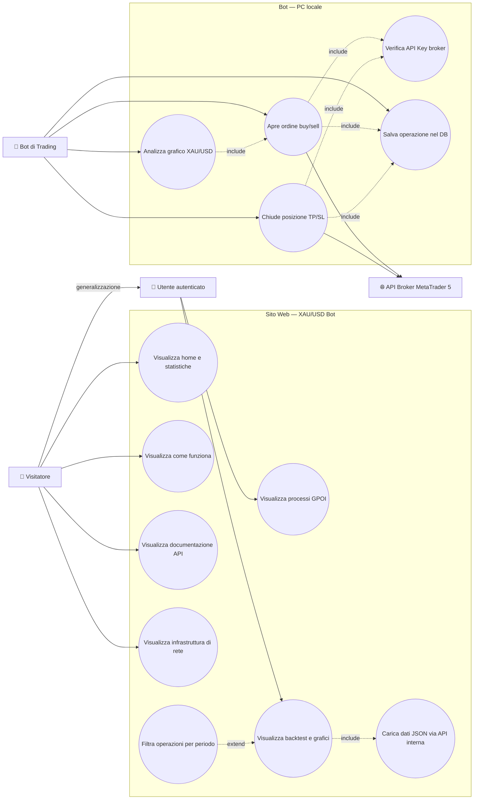

## Diagramma dei Casi d'Uso — XAU/USD Trading Bot

```mermaid
flowchart LR

    %% Attori
    V["👤 Visitatore"]
    U["👤 Utente autenticato"]
    B["🤖 Bot di Trading"]
    API["🌐 API Broker MetaTrader 5"]

    %% Sistema principale: sito web
    subgraph Sito["Sito Web — XAU/USD Bot"]

        UC1(("Visualizza home e statistiche"))
        UC2(("Visualizza come funziona"))
        UC3(("Visualizza documentazione API"))
        UC4(("Visualizza infrastruttura di rete"))
        UC5(("Visualizza processi GPOI"))
        UC6(("Visualizza backtest e grafici"))
        UC7(("Carica dati JSON via API interna"))
        UC8(("Filtra operazioni per periodo"))

    end

    %% Sistema: bot locale
    subgraph Bot["Bot — PC locale"]

        UC9(("Analizza grafico XAU/USD"))
        UC10(("Apre ordine buy/sell"))
        UC11(("Verifica API Key broker"))
        UC12(("Salva operazione nel DB"))
        UC13(("Chiude posizione TP/SL"))

    end

    %% Generalizzazione attori
    V -->|generalizzazione| U

    %% Visitatore → sito
    V --> UC1
    V --> UC2
    V --> UC3
    V --> UC4

    %% Utente → sito (funzioni aggiuntive)
    U --> UC5
    U --> UC6

    %% include e extend nel sito
    UC6 -.->|include| UC7
    UC8 -.->|extend| UC6

    %% Bot → bot system
    B --> UC9
    B --> UC10
    B --> UC12
    B --> UC13

    %% include nel bot
    UC9 -.->|include| UC10
    UC10 -.->|include| UC11
    UC10 -.->|include| UC12
    UC13 -.->|include| UC11
    UC13 -.->|include| UC12

    %% Bot → API esterna
    UC10 --> API
    UC13 --> API
```
