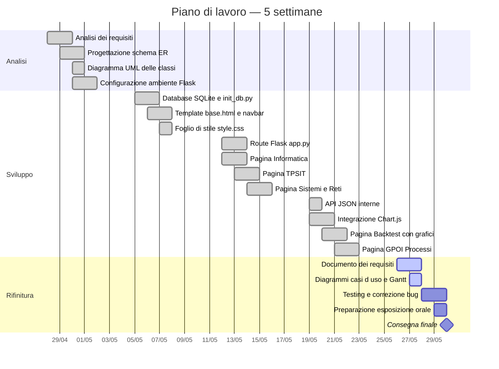

## Diagramma di Gantt — XAU/USD Trading Bot

```mermaid
gantt
    title Piano di lavoro — 5 settimane
    dateFormat YYYY-MM-DD
    axisFormat %d/%m

    section Analisi
    Analisi dei requisiti           :done, 2025-04-28, 2d
    Progettazione schema ER         :done, 2025-04-29, 2d
    Diagramma UML delle classi      :done, 2025-04-30, 1d
    Configurazione ambiente Flask   :done, 2025-04-30, 2d

    section Sviluppo
    Database SQLite e init_db.py    :done, 2025-05-05, 2d
    Template base.html e navbar     :done, 2025-05-06, 2d
    Foglio di stile style.css       :done, 2025-05-07, 1d
    Route Flask app.py              :done, 2025-05-12, 2d
    Pagina Informatica              :done, 2025-05-12, 2d
    Pagina TPSIT                    :done, 2025-05-13, 2d
    Pagina Sistemi e Reti           :done, 2025-05-14, 2d
    API JSON interne                :done, 2025-05-19, 1d
    Integrazione Chart.js           :done, 2025-05-19, 2d
    Pagina Backtest con grafici     :done, 2025-05-20, 2d
    Pagina GPOI Processi            :done, 2025-05-21, 2d

    section Rifinitura
    Documento dei requisiti         :active, 2025-05-26, 2d
    Diagrammi casi d uso e Gantt    :active, 2025-05-27, 1d
    Testing e correzione bug        :         2025-05-28, 2d
    Preparazione esposizione orale  :         2025-05-29, 1d
    Consegna finale                 :milestone, 2025-05-30, 0d
```
